# Shield Drug - System Block Diagrams

## 1. High-Level System Architecture

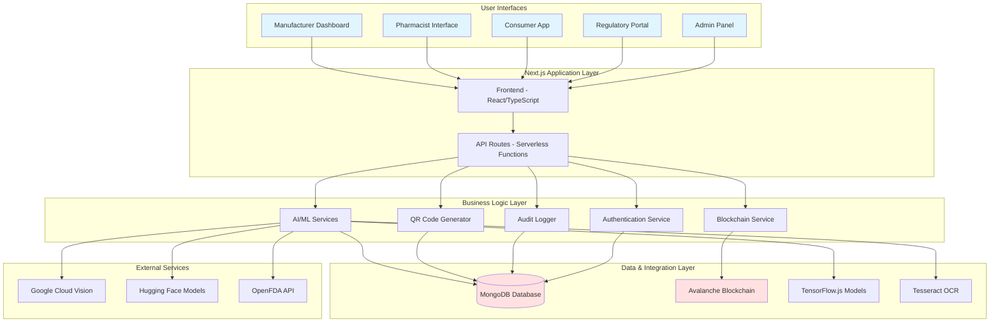

## 2. Multi-Stakeholder Architecture

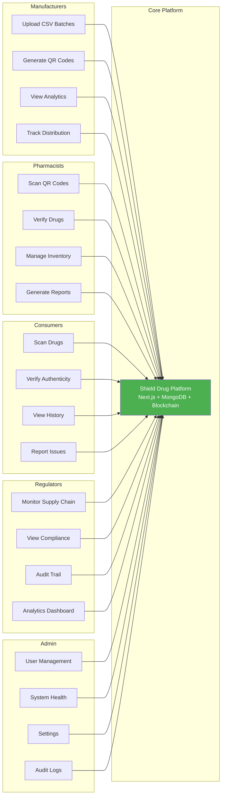

## 3. Manufacturer Upload Flow

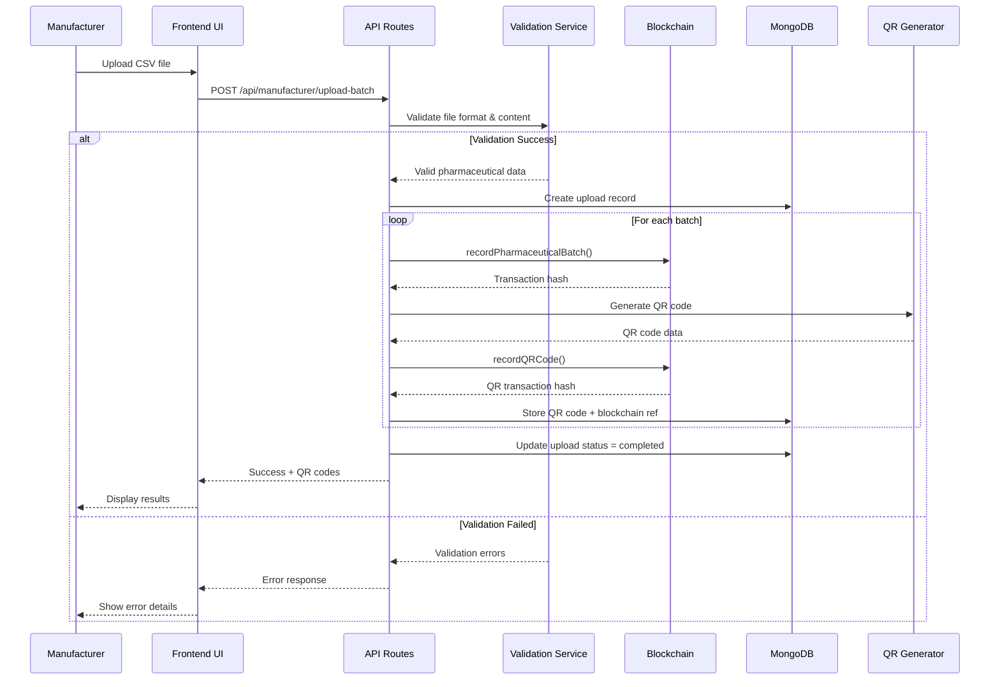

## 4. Drug Verification Flow

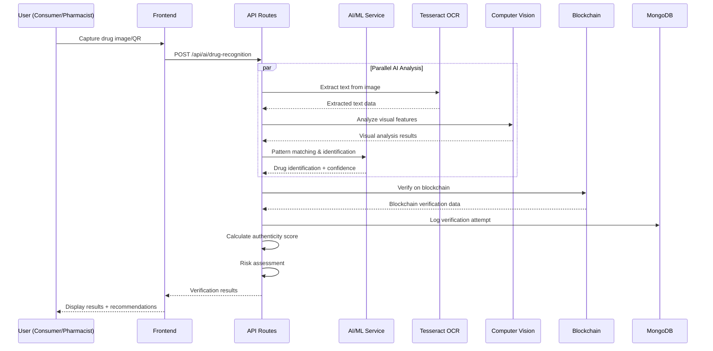

## 5. Technology Stack Diagram

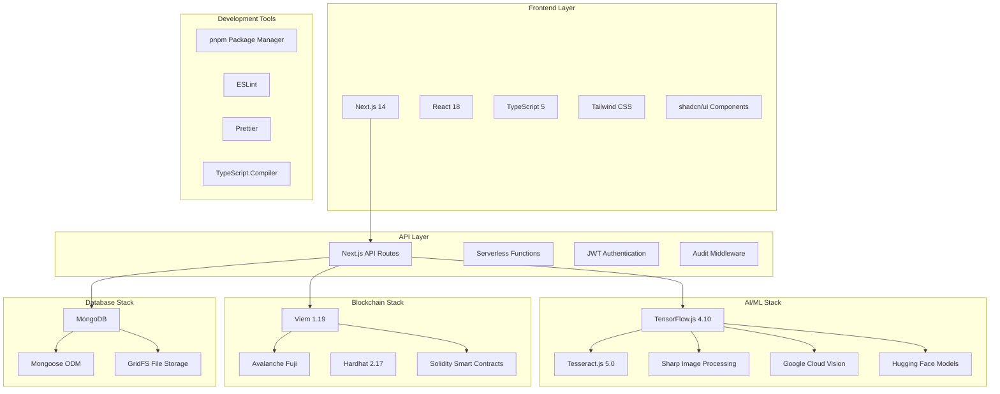

## 6. Data Flow Architecture

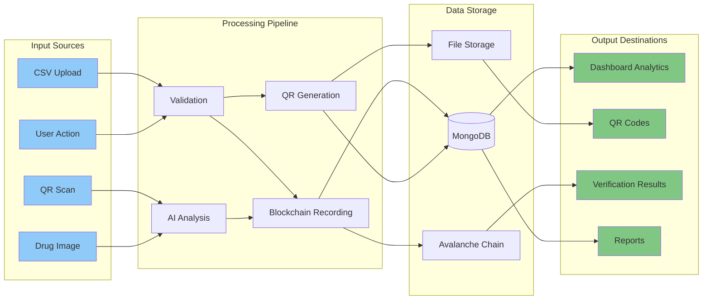

## 7. Security Architecture

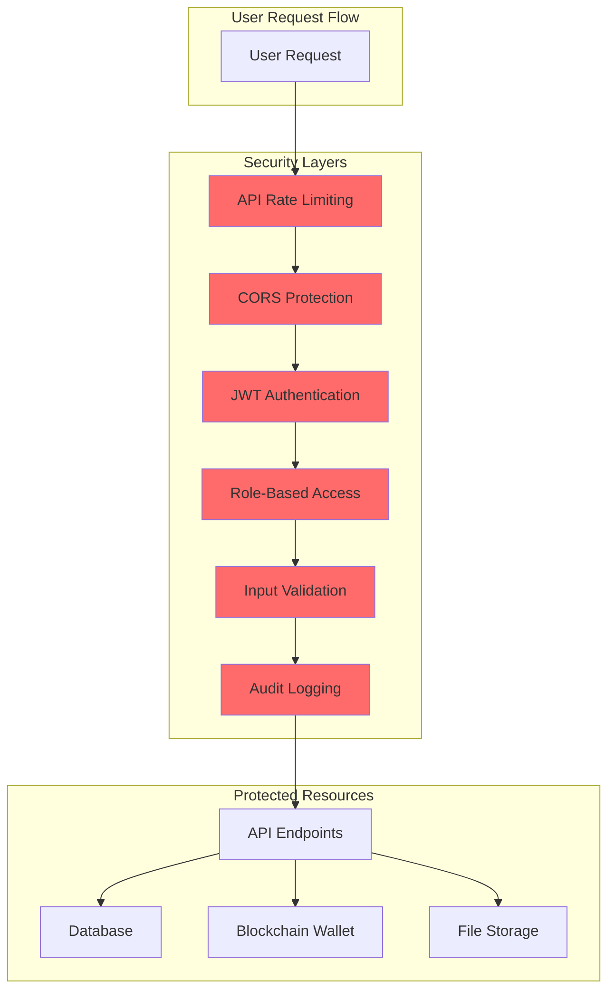

## 8. Database Schema Relationships

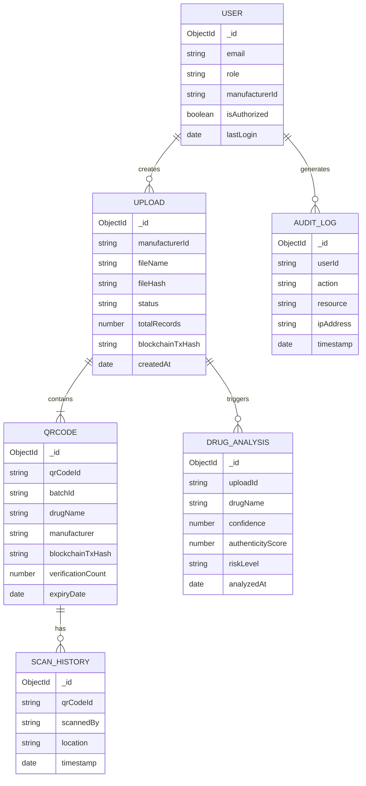

## 9. AI/ML Processing Pipeline

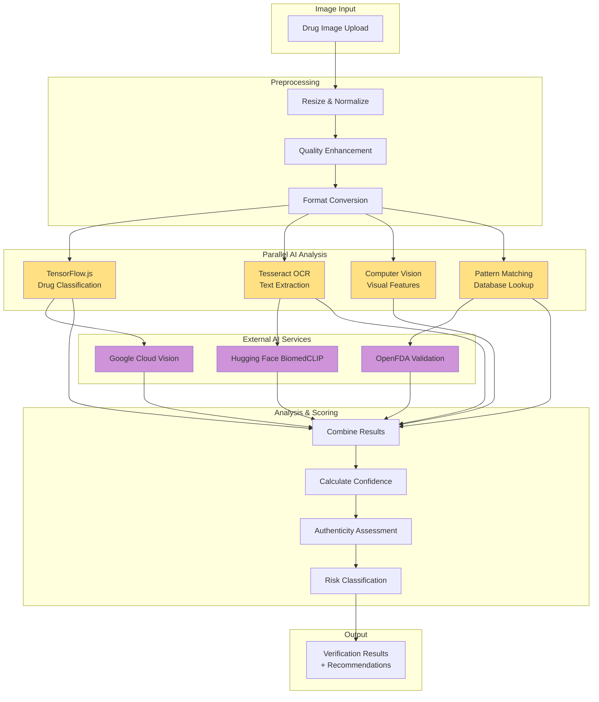

## 10. Blockchain Integration Architecture

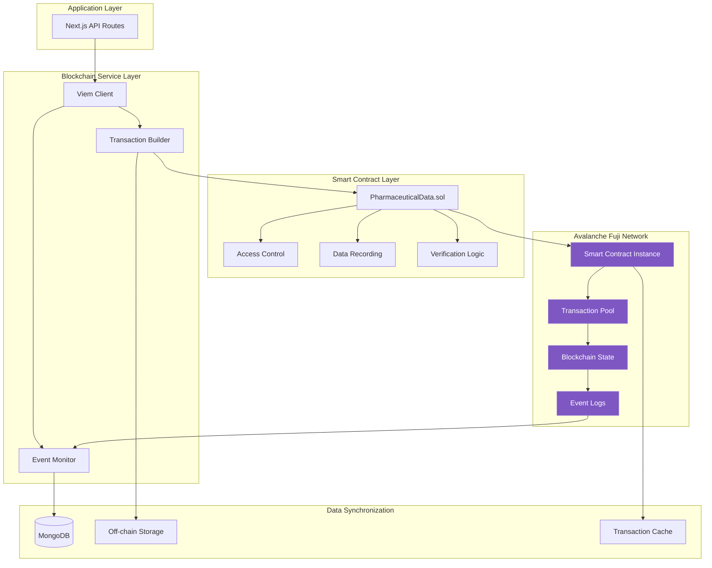

## 11. API Architecture

```mermaid
graph LR
    subgraph "Client Applications"
        C1[Web Browser]
        C2[Mobile App]
        C3[Admin Dashboard]
    end
    
    subgraph "API Gateway Layer"
        G1[Rate Limiter]
        G2[Authentication]
        G3[Authorization]
        G4[Request Logger]
    end
    
    subgraph "API Routes"
        A1[/api/manufacturer/*]
        A2[/api/pharmacist/*]
        A3[/api/consumer/*]
        A4[/api/regulatory/*]
        A5[/api/admin/*]
        A6[/api/ai/*]
        A7[/api/blockchain/*]
        A8[/api/qr-codes/*]
    end
    
    subgraph "Services"
        S1[Drug Analysis]
        S2[QR Generation]
        S3[Blockchain Service]
        S4[Report Generator]
    end
    
    C1 --> G1
    C2 --> G1
    C3 --> G1
    
    G1 --> G2
    G2 --> G3
    G3 --> G4
    
    G4 --> A1
    G4 --> A2
    G4 --> A3
    G4 --> A4
    G4 --> A5
    G4 --> A6
    G4 --> A7
    G4 --> A8
    
    A1 --> S2
    A1 --> S3
    A2 --> S1
    A2 --> S3
    A3 --> S1
    A4 --> S4
    A6 --> S1
    A7 --> S3
    A8 --> S2
```

## 12. Deployment Architecture

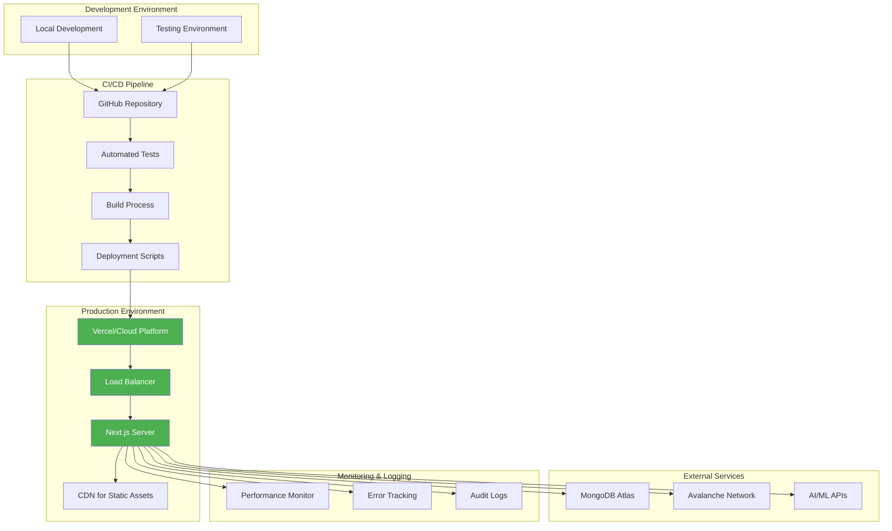

---

## Summary

These block diagrams illustrate the **Shield Drug** pharmaceutical authentication platform's comprehensive architecture, showing:

1. **High-level system architecture** with all major components
2. **Multi-stakeholder support** for manufacturers, pharmacists, consumers, and regulators
3. **Data flow patterns** for upload and verification
4. **Technology stack integration** across frontend, backend, AI/ML, and blockchain
5. **Security layers** protecting the system
6. **Database relationships** and schema design
7. **AI/ML processing pipeline** for drug recognition
8. **Blockchain integration** with Avalanche network
9. **API architecture** with role-based routing
10. **Deployment strategy** for production environments

The system demonstrates sophisticated integration of Next.js, MongoDB, Avalanche blockchain, TensorFlow.js, and multiple AI/ML services to create a comprehensive pharmaceutical authentication solution.
