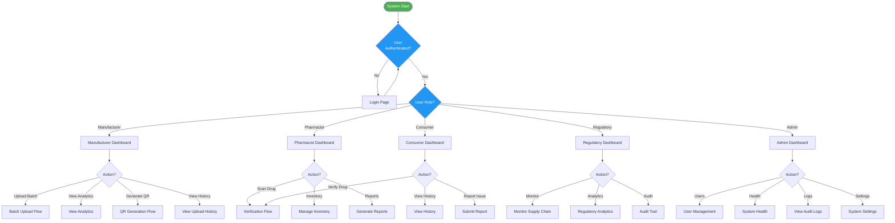
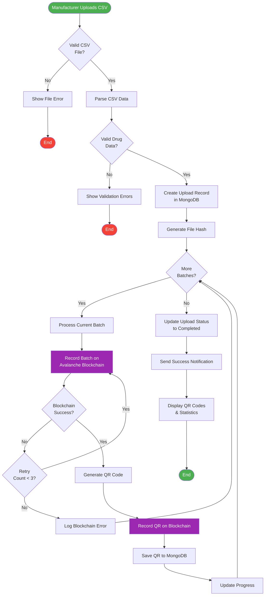
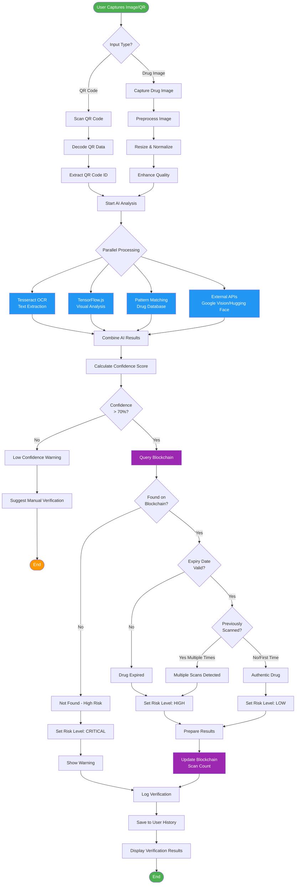
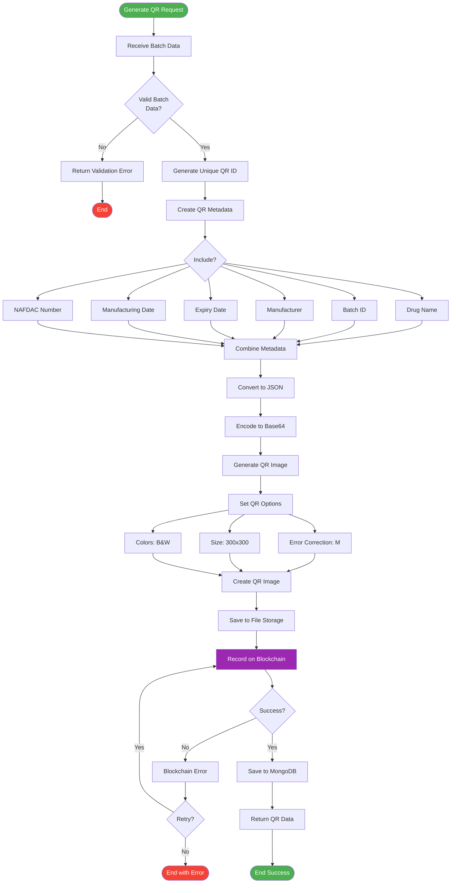
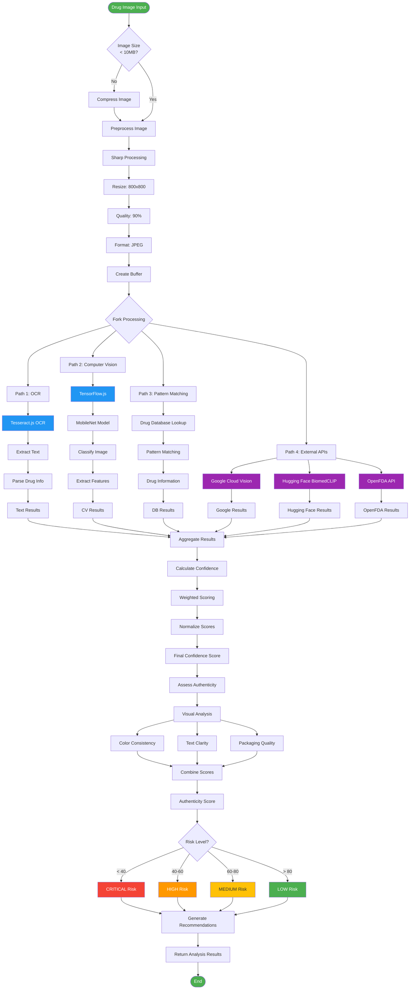
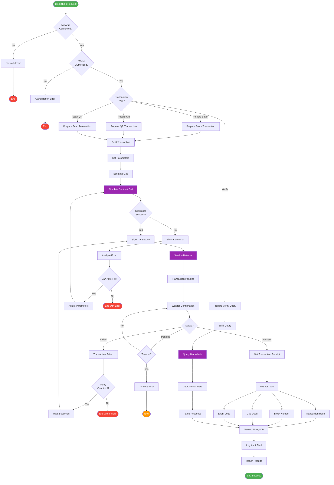
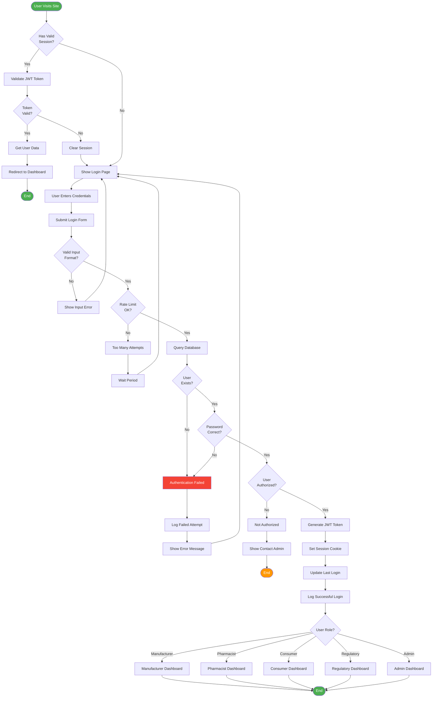
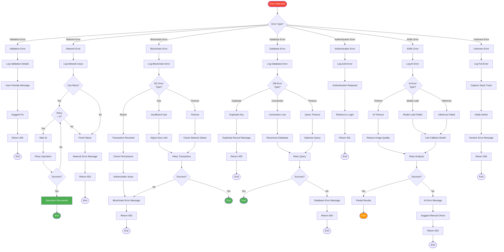
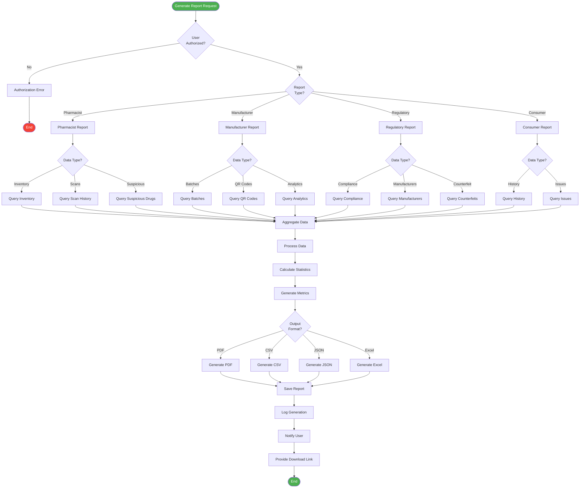
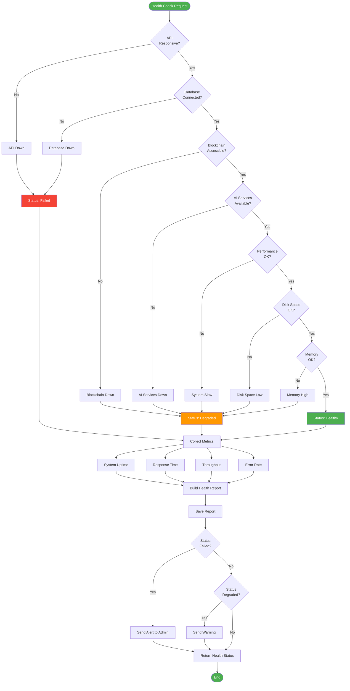

# Shield Drug - System Flowcharts

## 1. Overall System Flow

## 2. Manufacturer Batch Upload Flow

## 3. Drug Verification Flow (Consumer/Pharmacist)

## 4. QR Code Generation Flow

## 5. AI/ML Analysis Flow

## 6. Blockchain Transaction Flow

## 7. User Authentication Flow

## 8. Error Handling & Recovery Flow

## 9. Report Generation Flow

## 10. System Health Check Flow

---

## Summary

These flowcharts provide a comprehensive view of all major processes in the **Shield Drug** platform:

1. **Overall System Flow** - Complete user journey through the system
2. **Manufacturer Batch Upload** - CSV processing, validation, blockchain recording, and QR generation
3. **Drug Verification** - AI/ML analysis, blockchain verification, and risk assessment
4. **QR Code Generation** - Metadata encoding, image creation, and blockchain recording
5. **AI/ML Analysis** - Multi-model parallel processing and confidence scoring
6. **Blockchain Transaction** - Smart contract interaction with retry logic
7. **User Authentication** - Login, session management, and role-based access
8. **Error Handling** - Comprehensive error recovery strategies
9. **Report Generation** - Multi-format report creation for stakeholders
10. **System Health Check** - Monitoring and alerting system

Each flowchart demonstrates the sophisticated logic, error handling, and recovery mechanisms that ensure the platform's reliability and robustness.
