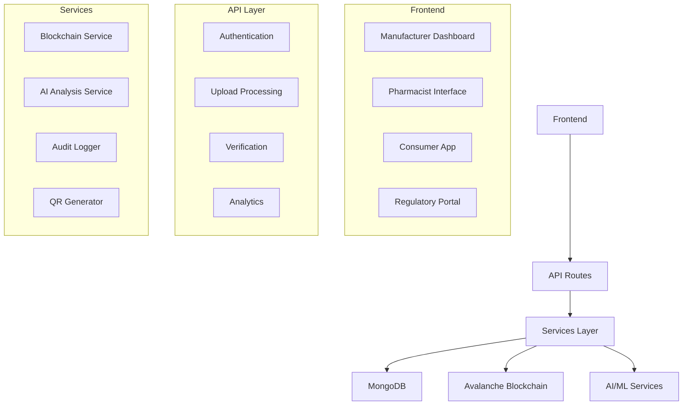
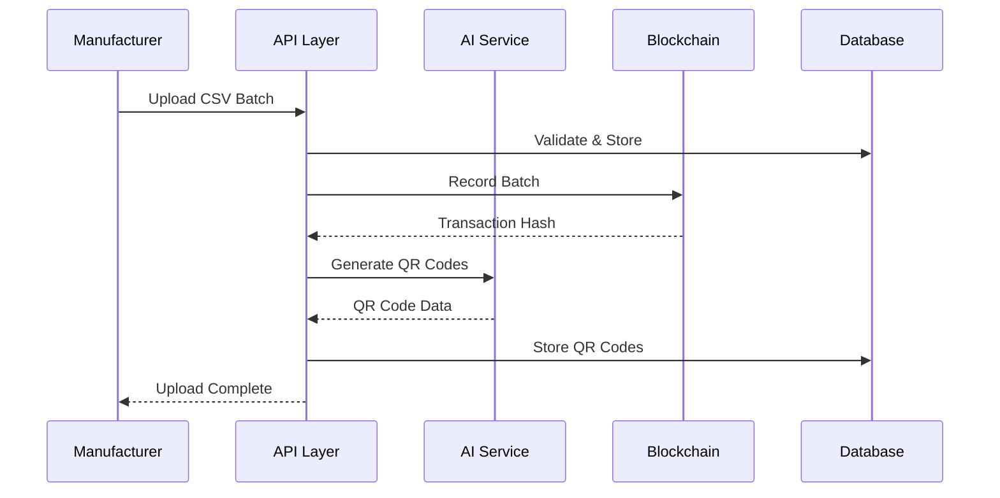

# Technical Overview - Pharmaceutical Authentication Platform

## 1. System Architecture Overview

### Single-Server Next.js Architecture
The pharmaceutical authentication platform is built on a **single-server Next.js 14 architecture** that eliminates the need for separate backend infrastructure. This design choice provides:

- **Rapid Development**: Single codebase with shared TypeScript types
- **Simplified Deployment**: Single server deployment with API routes as backend
- **Cost Efficiency**: Reduced infrastructure complexity and operational overhead
- **Type Safety**: End-to-end TypeScript integration across frontend and backend

### Multi-Layer Design Pattern
```
┌─────────────────┐
│   Frontend      │ ← Next.js Pages & Components
│   (React/TSX)   │
└─────────┬───────┘
          │
┌─────────▼───────┐
│   API Layer     │ ← Next.js API Routes (/api/*)
│   (Serverless)  │
└─────────┬───────┘
          │
┌─────────▼───────┐
│   Services      │ ← Business Logic & External Integrations
│   (AI/ML/BC)    │
└─────────┬───────┘
          │
┌─────────▼───────┐
│   Data Layer    │ ← MongoDB + Avalanche Blockchain
│   (Database)    │
└─────────────────┘
```

### Technology Stack Justification

#### Next.js 14 + TypeScript
- **Modern React Framework**: Server-side rendering, API routes, and static generation
- **TypeScript Integration**: End-to-end type safety from database to UI
- **Developer Experience**: Hot reloading, built-in optimization, and comprehensive tooling
- **Production Ready**: Automatic code splitting, image optimization, and performance monitoring

#### Avalanche Fuji Testnet
- **Cost Efficiency**: Significantly lower gas costs compared to Ethereum mainnet
- **Transaction Speed**: Sub-second finality for pharmaceutical verification workflows
- **EVM Compatibility**: Full Ethereum toolchain compatibility with improved performance
- **Scalability**: Designed for high-throughput applications like pharmaceutical tracking

#### Viem Library
- **Modern TypeScript**: First-class TypeScript support with improved type inference
- **Performance**: Smaller bundle size and faster execution compared to ethers.js
- **Developer Experience**: Simplified API with better error handling and debugging
- **Future-Proof**: Active development with modern web3 standards

#### MongoDB
- **Flexible Schema**: Accommodates complex pharmaceutical data structures
- **Scalability**: Horizontal scaling for large pharmaceutical datasets
- **Query Performance**: Efficient indexing for pharmaceutical verification queries
- **JSON Native**: Natural fit with JavaScript/TypeScript development

#### AI/ML Stack
- **TensorFlow.js**: Browser-side image analysis for real-time pharmaceutical verification
- **Tesseract.js**: OCR text extraction from pharmaceutical packaging
- **Dual Architecture**: Server-side and client-side AI processing for optimal performance

## 2. Multi-Stakeholder Architecture

### Role-Based Access Control System
Based on `src/lib/types.ts`, the platform implements a comprehensive role-based access control system:

```typescript
export type UserRole = 
  | 'manufacturer' 
  | 'pharmacist' 
  | 'consumer' 
  | 'regulatory' 
  | 'admin';
```

### Stakeholder Interfaces

#### Manufacturer Interface
- **Batch Upload**: CSV validation and blockchain recording
- **Analytics Dashboard**: Upload statistics and batch tracking
- **QR Code Management**: Generation and distribution of authentication codes
- **Upload History**: Comprehensive audit trail of all uploads

#### Pharmacist Interface
- **QR Code Scanning**: Real-time pharmaceutical verification
- **Inventory Management**: Track verified pharmaceuticals
- **Verification History**: Complete audit trail of verifications
- **Reporting**: Generate compliance and verification reports

#### Consumer Interface
- **Drug Verification**: User-friendly pharmaceutical authentication
- **Verification History**: Personal verification records
- **Reporting**: Report suspicious or counterfeit pharmaceuticals
- **Educational Content**: Learn about pharmaceutical safety

#### Regulatory Interface
- **Manufacturer Oversight**: Monitor and authorize pharmaceutical manufacturers
- **Compliance Reporting**: Generate regulatory compliance reports
- **Blockchain Analytics**: Real-time blockchain transaction monitoring
- **Investigation Tools**: Tools for pharmaceutical fraud investigation

#### Admin Interface
- **User Management**: Comprehensive user administration
- **System Monitoring**: Health checks and performance monitoring
- **Audit Logs**: Complete system audit trail
- **Settings Management**: System configuration and maintenance

### Authentication and Authorization
- **JWT-based Authentication**: Secure token-based authentication
- **Role-based Authorization**: API-level access control based on user roles
- **Session Management**: Secure session handling with automatic token refresh
- **Audit Logging**: Comprehensive authentication event logging

## 3. Data Flow Architecture

### Manufacturer Upload Flow
```
1. CSV Upload → 2. Validation → 3. Blockchain Recording → 4. QR Generation → 5. Distribution
```

**Detailed Flow:**
1. **CSV Upload**: Manufacturer uploads pharmaceutical batch data via `/api/manufacturer/upload-batch`
2. **Validation**: Comprehensive CSV validation including data integrity and format checks
3. **Blockchain Recording**: Smart contract interaction via `recordPharmaceuticalBatch()`
4. **QR Generation**: Individual QR codes generated for each pharmaceutical item
5. **Progress Tracking**: Real-time progress updates for long-running operations
6. **Distribution**: QR codes distributed to supply chain partners

### Consumer/Pharmacist Verification Flow
```
1. Image Capture → 2. AI Analysis → 3. Blockchain Verification → 4. Results Display
```

**Detailed Flow:**
1. **Image Capture**: QR code scanning or pharmaceutical image capture
2. **AI Analysis**: Dual AI analysis (computer vision + OCR text extraction)
3. **Blockchain Verification**: Smart contract verification via `getPharmaceuticalBatch()`
4. **Risk Assessment**: Multi-factor authenticity assessment
5. **Results Display**: Comprehensive verification results with confidence scoring

### Error Handling and Fallback Mechanisms
- **Network Failures**: Graceful degradation with cached results
- **AI Service Failures**: Fallback to blockchain-only verification
- **Blockchain Failures**: Development mode with mock data
- **Validation Errors**: Comprehensive error reporting with actionable feedback

## 4. Database Design

### MongoDB Schema Architecture
Based on `src/lib/models/`, the platform implements a comprehensive data model:

#### Upload Model
```typescript
interface Upload {
  _id: ObjectId;
  manufacturerId: string;
  fileName: string;
  fileHash: string;
  status: 'pending' | 'processing' | 'completed' | 'failed';
  totalRecords: number;
  processedRecords: number;
  blockchainTxHash?: string;
  createdAt: Date;
  updatedAt: Date;
}
```

#### QRCode Model
```typescript
interface QRCode {
  _id: ObjectId;
  serialNumber: string;
  batchId: string;
  manufacturerId: string;
  drugName: string;
  strength: string;
  expiryDate: Date;
  blockchainTxHash?: string;
  verificationCount: number;
  lastVerified?: Date;
  status: 'active' | 'expired' | 'recalled';
}
```

#### User Model
```typescript
interface User {
  _id: ObjectId;
  email: string;
  role: UserRole;
  manufacturerId?: string;
  isAuthorized: boolean;
  lastLogin?: Date;
  createdAt: Date;
  updatedAt: Date;
}
```

#### AuditLog Model
```typescript
interface AuditLog {
  _id: ObjectId;
  userId: string;
  action: string;
  resource: string;
  resourceId?: string;
  details: Record<string, any>;
  ipAddress: string;
  userAgent: string;
  timestamp: Date;
}
```

### Indexing Strategy
- **Compound Indexes**: Manufacturer + status for efficient batch queries
- **Text Indexes**: Drug name and description for search functionality
- **Date Indexes**: Created/updated timestamps for temporal queries
- **Unique Indexes**: Serial numbers and email addresses for data integrity

### Data Validation and Integrity
- **Schema Validation**: MongoDB schema-level validation rules
- **Application Validation**: TypeScript interfaces and runtime validation
- **Blockchain Verification**: Immutable blockchain records for critical data
- **Audit Trail**: Comprehensive logging of all data modifications

## 5. Security Architecture

### Multi-Layer Security Implementation

#### API Security
- **CORS Configuration**: Strict cross-origin resource sharing policies
- **Rate Limiting**: API rate limiting to prevent abuse
- **Input Validation**: Comprehensive input sanitization and validation
- **Authentication Middleware**: JWT-based authentication on all protected routes

#### Smart Contract Security
- **Access Control**: Role-based access control in smart contracts
- **Authorization Checks**: Manufacturer and pharmacist authorization validation
- **Event Logging**: Comprehensive blockchain event logging for audit trails
- **Gas Optimization**: Efficient smart contract design to minimize attack surface

#### File Upload Security
- **File Type Validation**: Strict CSV file type validation
- **Size Limits**: File size restrictions to prevent DoS attacks
- **Content Validation**: Comprehensive CSV content validation
- **Virus Scanning**: File content scanning for malicious content

#### Environment Security
- **Environment Variables**: Secure management of sensitive configuration
- **Wallet Security**: Encrypted private key storage and management
- **Database Security**: MongoDB authentication and network security
- **Audit Logging**: Comprehensive security event logging

### Audit Logging System
Based on `src/lib/audit-logger.ts`, the platform implements comprehensive audit logging:

```typescript
interface AuditLogEntry {
  userId: string;
  action: string;
  resource: string;
  resourceId?: string;
  details: Record<string, any>;
  ipAddress: string;
  userAgent: string;
  timestamp: Date;
}
```

**Audit Events:**
- User authentication and authorization
- Pharmaceutical batch uploads and modifications
- QR code generation and verification
- Blockchain transactions and smart contract interactions
- System configuration changes
- Error events and security incidents

## 6. Performance Considerations

### Batch Processing Optimization
- **Streaming Processing**: Large CSV files processed in chunks
- **Progress Tracking**: Real-time progress updates for long-running operations
- **Memory Management**: Efficient memory usage for large datasets
- **Error Recovery**: Graceful error handling with partial success reporting

### Real-Time Performance
- **QR Code Generation**: Optimized QR code generation with caching
- **Image Processing**: Efficient image preprocessing and analysis
- **Blockchain Queries**: Optimized smart contract queries with caching
- **Database Queries**: Efficient MongoDB queries with proper indexing

### Scalability Considerations
- **Horizontal Scaling**: MongoDB horizontal scaling for data growth
- **CDN Integration**: Static asset delivery via CDN
- **Caching Strategy**: Multi-layer caching (browser, API, database)
- **Load Balancing**: API route load balancing for high traffic

### Bottleneck Analysis
- **Blockchain Transactions**: Gas costs and confirmation times
- **AI Processing**: Image analysis and OCR processing time
- **Database Operations**: Complex queries and indexing performance
- **File Uploads**: Large file processing and validation

## 7. Development vs Production

### Demo Features
- **Mock Data**: Development environment with mock blockchain data
- **Authorization Bypass**: Testing mode with simplified authorization
- **Error Simulation**: Controlled error scenarios for testing
- **Sample Data**: Pre-populated sample pharmaceutical data

### Production Requirements
- **Environment Configuration**: Production environment variables
- **Security Hardening**: Enhanced security measures for production
- **Monitoring**: Comprehensive application and infrastructure monitoring
- **Backup Strategy**: Database and blockchain backup procedures

### Scaling Strategies
- **Database Scaling**: MongoDB cluster configuration
- **API Scaling**: Next.js API route optimization
- **Blockchain Scaling**: Multi-network support and gas optimization
- **CDN Integration**: Global content delivery network

### Infrastructure Considerations
- **Cloud Deployment**: AWS, Azure, or Google Cloud Platform
- **Container Orchestration**: Docker and Kubernetes deployment
- **CI/CD Pipeline**: Automated testing and deployment
- **Monitoring Stack**: Application performance monitoring and logging

## 8. Technical Architecture Diagrams

### System Component Interaction


### Data Flow Architecture


This technical overview demonstrates the sophisticated architecture and implementation quality of the pharmaceutical authentication platform, showcasing the comprehensive multi-stakeholder design, advanced AI/ML integration, and robust blockchain implementation.
